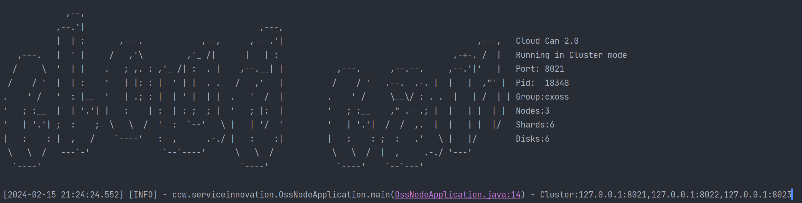
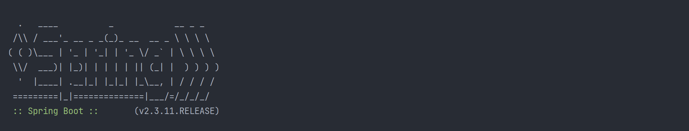

# Cloud Can

## Overview

cloud-can 是一个分布式对象存储系统(object storage system)。

对象存储是一种用于存储和检索大量非结构化数据的数据存储模式。与传统的文件系统存储不同，对象存储不以文件层次结构进行组织，而是将数据存储为对象，每个对象都包含数据、元数据和一个唯一的标识符。对象存储通常用于存储大型文件和多媒体内容，例如图片、音频、视频、备份和归档数据。

相对于传统的文件系统和块存储，Cloud Can的优点：

**安全性高**：上层为用户提供了丰富的权限设置，底层提供了加密存储。

**可靠性高**：提供冗余功能，保证数据的可靠性和安全性。

**扩展性好**：可以无缝扩展存储容量，满足海量数据存储需求。

**高性能**：允许高并发访问和快速读写操作，适用于高并发场景。

**存储效率高**：采用分布式存储技术和先进的共识算法，维护数据和元数据的效率和一致性高。

存储桶（Bucket）： 存储桶是对象存储系统中用于组织和管理对象的容器。存储桶可以看作是文件系统中的文件夹，用于对对象进行逻辑分组和管理。存储桶具有**唯一**的名称，每个用户可以创建至多1000个存储桶，一个或多个对象可以存储在同一个存储桶中。

对象（Object）： 对象是存储在对象存储系统中的基本单位。每个对象都由数据本身和与之关联的元数据组成。

## Features and Plan

### Application Layer Features

- [x] 多用户访问（用户与子用户）
- [x] 对象访问控制列表（Object Access Control List）
- [x] 对象桶访问控制列表（Bucket Access Control List）
- [x] 对象桶访问策略（Bucket Access Policy）
- [x] 对象秘钥访问(Access Key)
- [x] 支持小文件加速上传、对象秒传、分片上传、大文件上传
- [x] 支持对象元数据访问，对象二进制数据下载
- [x] Bucket内支持文件夹逻辑（文件夹可以理解为一个只有元数据的空对象）
- [x] 支持对象标签
- [x] 支持用户收藏Bucket功能
- [X] 提供SDK进行客户端访问，可与SpringBoot应用结合使用

### Plan

- [ ] SDK支持跨语言(Java、Python)
- [ ] SDK支持更多协议（S3、FTP）

### Storage Layer Features
- [x] 提供NodeClient对所有存储节点进行管理
- [x] 支持RS模式，并且提供文件分片存储
- [x] 支持一致性hash（hash环）和crush算法（权重算法）对数据进行定位和负载均衡
- [x] Node层支持强一致性读和弱一致性读
- [x] 可进行存储容量水平扩容
- [X] 利用反射机制解耦合状态机和处理实现
- [x] Node索引支持本地的KV数据库实现（leveldb）
- [x] 支持高并发访问
- [X] 支持多种对象的Unique Key计算（MD5、CRC32）

### Storage Layer Optimize

- [X] 采用Lease Read提供强一致性读，减少RPC和落盘开销
- [X] 存储层减少对于中间件的依赖，元数据采用去中心化的方式存储
- [X] 优化状态机apply方法从串行到并行，减少IO等待

### Plan

- [ ] Node支持snapshot
- [ ] 利用Nacos配置中心进行Node配置
- [ ] 支持一键部署

## Requirements

中间件: Mysql 8+ 、Redis 3+ and Ncos 2.0.4 .

编译: JDK 8+ and Maven 3.2.5+ .

## How To Start

nacos安装

`wget https://github.com/alibaba/nacos/releases/download/2.0.4/nacos-server-2.0.4.tar.gz`

`tar -zxvf nacos-server-2.0.3.tar.gz`

`mv nacos /usr/local`

`cd /usr/local/nacos/bin`

`sh startup.sh -m standalone`

1. mysql 和 Redis 安装


`sh startup.sh -m standalone`

`chmod 755 redis-install.sh && sh redis-install.sh 4.0.10`

`chmod 755 mysql-install.sh && sh mysql-install.sh`

2. 项目启动

`git clone git@github.com:llzcx/cloud-can.git`

`cd cloud-can-mater`

`mvn clean install`

`mvn package`

`java -cp -jar target/oss-node-0.0.1-SNAPSHOT.jar ccw.serviceinnovation.OssNodeApplication {node运行参数}`

`java -cp -jar target/oss-service-0.0.1-SNAPSHOT.jar ccw.serviceinnovation.OssApplication {service运行参数}`

group_name为Group的唯一ID

group_cluster指定了当前Group所有的节点

election_timeout为超时选举时间（ms）

data_shards和parity_shards为RS分片配置

encrypt为加密方式，NULL为不加密，目前支持SM4加密

wight与Group配置成正比。

注：Group内节点配置数目建议为3、5个。

node运行参数
```
--host=127.0.0.1
--port=8021
--group_name=cxoss
--group_cluster=127.0.0.1:8021,127.0.0.1:8022,127.0.0.1:8023
--election_timeout=1000
--log_disk=./log
--partition_disk=./1,./2,./3,./4,./5,./6
--data_shards=4
--parity_shards=2
--nacos_host=127.0.0.1
--nacos_port=8848
--encrypt=NULL
--wight=1
```

service运行参数
```
--server.address=0.0.0.0
--server.port=8080
--nacos.addr=127.0.0.1:8848
--naocs.username=nacos
--nacos.password=nacos
--redis.ip=127.0.0.1
--redis.port=6379
--mysql.addr=127.0.0.1:3306
--mysql.username=root
--mysql.password=chenxiang
```



## Documents

1. [功能介绍](doc/功能介绍.md)
2. [技术路线与原理](doc/技术路线与原理.md)
3. [目录结构](doc/目录结构.md)


